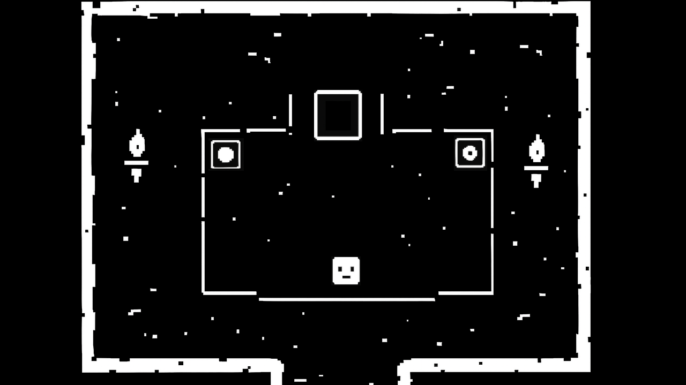
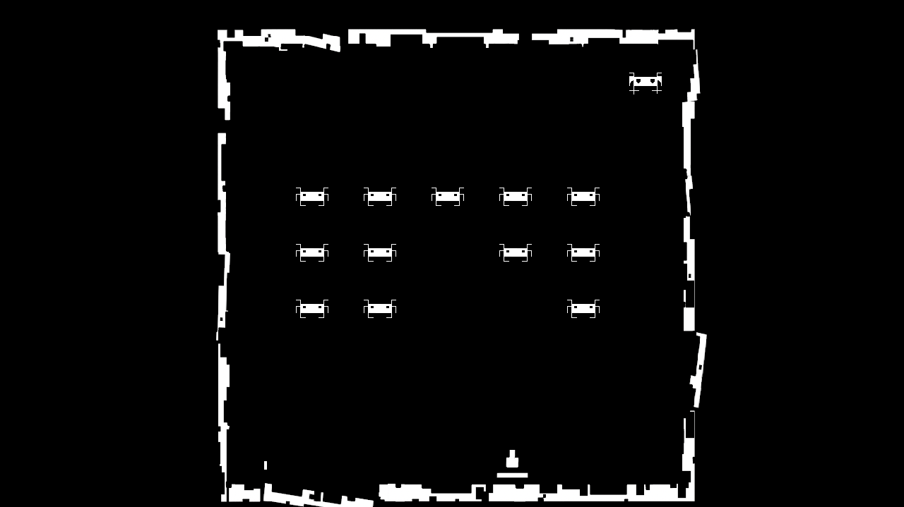

# GDevelop Game

> A WIP top-down adventure inspired by Undertale, where progression depends on completing classic mini-games.  

## About This Project
This game is currently unfinished and does not have a final name. I’m using this repository as a **learning and portfolio project** to:  
- Explore **game mechanics** and scene design  
- Understand the challenges of game development  
- Document problems, solutions, and ideas for future improvements  

The concept is a top-down adventure where players complete various mini-games, inspired by classics like **Space Invaders**, **Pong**, and more, to progress through levels.

## Purpose
This repo serves three purposes:
1. **Portfolio:** Showcasing my ongoing work and learning process.
2. **Documentation:** Recording challenges, problems, and solutions encountered while using GDevelop.
3. **Idea Archive:** Collecting ideas for future gameplay features, mini-games, and level designs.

## Current Status
- Game engine: GDevelop
- Progress: Early prototype; basic top-down movement and mini-game framework set up
- Mini-games implemented: 2 mini-games, ~70% complete  
- Art & assets: Mostly placeholders, created by me in Paint

## Challenges & Learning Notes
Some of the key problems I’ve encountered while working with GDevelop:
- Implementing classic game mechanics in a flexible way
- Health system to be tied to an element in the game
- Game Over Screen and Logic
- Many more

## How to Play
1. Open `game.json` in [GDevelop](https://gdevelop.io/).  
2. Run the project and experiment with the prototype mini-games.

## Screenshots

## License
This project is licensed under the MIT License. See [LICENSE](LICENSE) for details.

